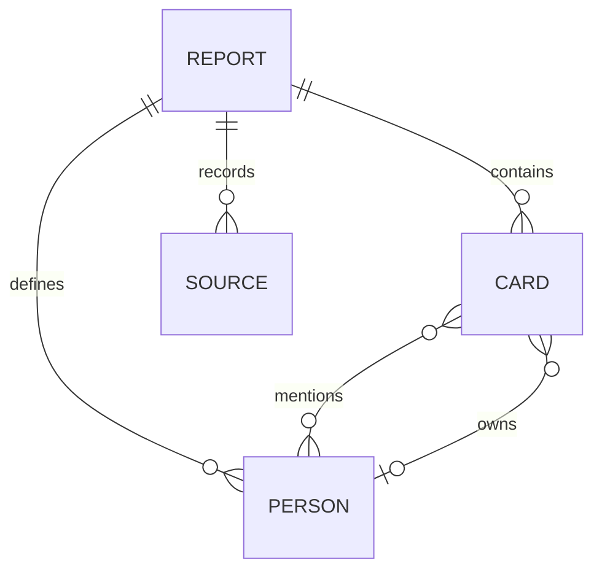

# Architecture and maintenance

Brief is a macOS app with a native capture shell and a shared report engine. SwiftUI/AppKit owns the menu bar, OS dialogs and local file persistence; WKWebView hosts the feature-oriented JavaScript workspace. Browser development uses the same modules with browser storage. The optional Node/Jev server is not bundled into the Mac app. Browser persistence uses IndexedDB; native persistence uses atomic files.

## Where a change belongs

| Change                                       | Place                                    |
| -------------------------------------------- | ---------------------------------------- |
| Card editing fields and behavior             | `src/features/reports/card-editor.js`    |
| Owner entry and preserved mention references | `src/features/reports/card-editor.js`    |
| Report composition and ordering UI           | `src/features/reports/report-page.js`    |
| Upload formats or file decoding              | `src/features/intake/material-reader.js` |
| Staging, creation, append/undo workflow      | `src/features/intake/intake-page.js`     |
| Sharing UI and copy/download behavior        | `src/features/sharing/sharing.js`        |
| Data validity, percentages, readiness checks | `src/domain/report.js`                   |
| Output markup and escaping                   | `src/domain/export.js`                   |
| Storage, migration, backup/restore           | `src/data/report-repository.js`          |
| Feature appearance                           | CSS beside the feature                   |
| Route activation and feature wiring          | `src/app.js`                             |

A function belongs with the feature that owns its behavior. Do not create a file for every small function. Extract a module when it has an independent responsibility, a reusable contract, or a separate reason to change. Templates and event handlers remain together for small features. The static page landmarks remain in `index.html` so browser accessibility tools can inspect a normal document.

Dependencies point inward: UI features call domain rules and the repository. Domain functions know nothing about the DOM, localStorage, or clipboard. The app supplies a small context with the current report, repository, navigation, and commit/render hooks. Feature modules do not import one another's mutable state.

Rendering does not save data. Commands commit changes explicitly. This keeps theme changes and previews from generating storage writes.

## DTO, DAO, repository: different responsibilities

**DTO (Data Transfer Object)** defines the data crossing a boundary. Our backup DTO is:

```json
{
  "format": "brief-library",
  "version": 1,
  "exportedAt": "2026-09-25T00:00:00.000Z",
  "reports": []
}
```

`parseBackup()` validates this external data before it enters the app. DTOs are useful here because persisted files outlive individual code versions. We use plain objects and runtime validation rather than classes with no behavior.

**DAO (Data Access Object)** typically encapsulates low-level database operations: insert a card, query owners, update a row. The storage adapter owns IndexedDB transactions or native file batches; feature-specific DAOs are unnecessary.

**Repository** gives the application a storage-oriented contract: load reports, save a report, remove it, restore copies, flush pending writes. `ReportRepository` uses a preloaded memory cache for reads and asynchronous writes through `src/platform/library-storage.js`. The adapter stores immutable report/asset records and atomically changes a versioned manifest. It migrates legacy libraries without deleting their original data.

Startup waits for storage readiness. Saves expose pending/failure states, reject stale manifests, and drain edits arriving during an in-flight write before reporting completion. Read failures protect existing data from overwrite.

## Data relationships



- One report has many cards, people, and source records.
- A card has zero or one owner. A person can own many cards. From the card side, this is many-to-one; from the person side, it is one-to-many. They describe the same relationship.
- A card can mention several people; a person can appear in several cards. That is many-to-many.
- Current sources carry names/fingerprints, while cards preserve source text. They are not yet a normalized foreign-key relationship.

The POC nests cards and people inside a report because it loads, backs up, and restores the report as one unit. Person IDs are report-local. Restoring a report changes its report ID and preserves the internal IDs and references.

In a future relational database, use `reports`, `cards(report_id, owner_id)`, `people`, `report_members(report_id, person_id)`, `card_mentions(card_id, person_id)`, `sources`, and `card_sources`. `card_mentions` is the join table for the many-to-many relationship. Directory identity and permissions would require additional design. Relationships and DTO/DAO are not alternatives: one describes data cardinality; the others describe software boundaries.

## Choices and tradeoffs

1. **Vanilla ES modules:** no runtime framework or build pipeline needed to launch. A framework becomes useful if stateful interaction grows substantially; folder count alone does not justify a rewrite.
2. **Asynchronous local storage:** separate immutable report and asset records, a 256 MiB serialized-memory budget, transactional manifest conflict checks, unsaved-state feedback, backup restore and protected legacy migration. Browser shutdown can still interrupt work; native quit awaits the save drain. Unreachable autosave objects are reclaimed at next startup after validating all current references. Temporary versions during a session mean the logical budget is not a hard disk-usage cap.
3. **Explicit transformation:** split paragraphs, honor explicit section labels, and preserve source wording. No probabilistic summaries to audit.
4. **Shared content renderer:** editor previews and exported cards reuse the same semantic HTML and inline styles. Editing controls and actionable prompts wrap that content only in the app. Domain and browser tests check escaping and copied content.
5. **Defensive imports:** validation rejects broken relationships, duplicate identifiers, malformed image URLs, and unsupported backup versions. Decoding uploads is separate from syntax validation of persisted images. A syntactically valid backup image can still contain undecodable bytes; use only trusted backups and review restored visuals.

## Maintenance rules

- Keep meaningful names, use the formatter, and run lint before a change is complete.
- Add tests for user-visible behavior or failure boundaries. Avoid assertions that merely repeat implementation details.
- A new persisted field needs validation, backup compatibility consideration, and export review.
- A new input type needs size limits, failure handling, and a browser test.
- A new sharing format needs a destination-client verification record.
- Do not write directly to localStorage from feature code. Appearance preferences are owned by the shared shell.
- Avoid speculative service layers, global mutable modules, or database abstractions without a consumer.

## Optional AI boundary

The AI feature has its own request/result DTO and an isolated provider adapter. The browser sends selected titles and bodies after explicit confirmation, up to 10 sequential requests per review. `server/jev-client.mjs` maps those fields to TypeSafe's typed question API and validates the result. The UI treats the response as a suggestion; applying a card type is a separate command. This keeps a model failure from becoming a persistence or reporting failure. See `JEV.md` for configuration and evaluation limitations.

## Report sections

Cards have an optional `section` field: `progress`, `decision`, or `next`. Legacy cards without it display in Progress, except decision cards, which remain under Needs a decision. Existing backups remain valid. Sections affect display/export grouping; movement is within the current section. Owner entry is co-located with card editing and continues to use report-local person IDs.

Native sharing capability checks and mailto payload encoding live in `src/features/sharing/native-share.js`; the sharing UI owns buttons, dispatch status and fallbacks. The complete standalone HTML shell owns centering, keeping copied fragments and editor layout independent.

## Structured data imports

`src/domain/datasets/parse.js` parses JSON/JSONL and profiles scalar fields using escaped JSON pointers. `evaluation.js` provides a narrow adapter for Eval Studio compress candidate evaluations. `analyze.js` produces deterministic descriptive findings. These modules have no DOM or network dependencies. `src/features/data-import/data-import.js` owns field selection, review, and conversion of accepted findings into existing report cards; intake owns staging and persistence.

This is a local file workflow, so it needs no DAO or database relationship model. The report repository remains the persistence boundary. Raw data is retained once per source; cards carry the filename, SHA-256 snapshot hash, field rules, and evidence locations. Import fingerprints include the configuration and selected findings, allowing different views of one file without accidentally treating them as identical imports. The original file is included in library backups; sharing report cards does not include the original dataset.

The interaction borrows the evidence-first, review-before-report approach of Eval Studio's `statistic-copilot` and `md-report-skill`, with a separately implemented browser adapter. No Lark CLI, credentials, model calls, or external publishing are needed. No skill files or external implementation were copied into the runtime.

## Visuals and output adapters

Cards optionally contain a validated `visual` DTO (kind, title, caption, columns, rows), a generated PNG `chartImage`, and an HTTP(S) `link`. Chart geometry and HTML tables consume the same numbers through `domain/visuals`; imported raw SVG/HTML is never trusted as a report renderer. Numeric analysis and paired comparison are separate modules. The compress adapter creates a stable record/turn pairing key while preserving candidate evidence coordinates.

Intake owns source-level selection/section assignment and a live report preview. Report cards expose direct section changes. `features/intake/html-reader.js` reads an inert HTML template into bounded text/table DTOs, with no executable source markup or external asset loading.

`features/slides` is an on-demand export adapter using vendored PptxGenJS 4.0.1. It paginates content locally and exports native text/tables plus embedded chart images. `domain/calendar.js` serializes a reviewed event draft; `features/meetings` owns its form. Neither feature adds database relationships, backend scheduling, credentials, or message delivery. Vendor code and licenses live outside maintained feature modules; the build explicitly includes the vendor directory.

## Schema-aware quick import

`domain/datasets/case-report.js` recognizes the supported case artifact and creates attributed findings without treating its instructions as executable actions. `field-choices.js` owns generic field recommendations and labels independently of arithmetic. `features/data-import/case-review.js` provides a ready-to-review path with an explicit manual fallback. Both import paths share `build-material.js` for snapshots, chart rasterization and report card construction. The analysis fingerprint version is now 3, so earlier text-only imports do not silently replace revised interpretations.

## Interface and snippet terminology

Apple's App Intents snippets are compact system views in Siri, Spotlight and Shortcuts. Brief's snippet cards are portable project-report content, not App Intents integrations. The assignment does not explicitly require Apple's native snippet API. The interface borrows the principles of glanceable content, consistent spacing and clear actions from [Apple's snippet design session](https://developer.apple.com/videos/play/wwdc2025/281/).

The web UI uses system typography, neutral surfaces, restrained blue actions and distinct rounded report cards. Shared CSS tokens own application colors; the report export renderer uses explicit light colors and inline styles so previews and HTML exports remain consistent. The white report canvas intentionally previews the export in either application theme. Color theme changes are immediate to avoid transient text/background contrast failures. No Apple logos, bundled SF fonts or SF Symbols are required.

The original SVG control set in `src/shared/icons.js` uses one viewBox and stroke weight, scales with text and remains decorative to assistive technology. Visible labels or existing accessible names identify actions. Brief's original B monogram uses layered color and highlights inspired by [Icon Composer](https://developer.apple.com/icon-composer/); control alignment takes guidance from [SF Symbols](https://developer.apple.com/sf-symbols/). No downloaded Apple symbols or Icon Composer-generated assets are bundled.

The [Apple Design Resources](https://developer.apple.com/design/resources/) macOS UI-kit preview also informs grouped settings surfaces, inline label/control rows and secondary action hierarchy. Mobile controls use 44 CSS-pixel minimum heights and segmented view selection. The introduction is compact to prioritize the reporting workspace. These are web adaptations of the inspected official preview, not imported Figma/Sketch components; the linked Figma file was unavailable through the browser tool. Apple artwork is not included in the public build.

## Documents and visual delivery

`features/intake/document-reader.js` owns bounded PDF/Word extraction; `document-review.js` owns selection and placement. Parsing libraries are vendored and loaded only on demand from the same origin. The local server allows only their specific public module/font/map paths, with JavaScript MIME types for `.mjs` workers.

`features/sharing/report-images.js` lays out validated report content into bounded PNG pages. `visual-sharing.js` separates preparation from the user-activated native share call and releases preview URLs when the dialog closes. PDF delivery uses escaped report HTML in a print window, with pagination styles and selectable text; it is a browser Save as PDF flow, not a server conversion. The original rich HTML clipboard action is now also exposed prominently.

## Project risk signals

`domain/risk-review.js` owns deterministic bilingual signal rules, local review dates and source-based duplicate checks. `features/risk-review` owns user confirmation, adding discussion cards and undo. Findings are not saved until selected; they use existing card/source fields, avoiding a database migration. Generated cards carry a source marker and never feed back into risk detection. Users can edit them normally. Text patterns identify potential signals, not project health or probability; past due dates request completion verification rather than declaring overdue work.

## Optional retrospective presentation

`Report.template` is optional (`standard` or `retrospective`); legacy reports default to standard. Validation rejects unknown values. `consensus` is an additional card section. Both fields persist through the existing repository/backup DTO without a destructive migration. `domain/report-template.js` owns presentation only and receives escaping/card renderers as dependencies to avoid a module cycle. It groups the existing sections, renders plain-text next steps as an action table, and preserves richer action cards in full. No status, causal claim or risk probability is inferred by the layout. HTML, PDF and preview share `reportFragment`; email fallback, PNG and PPTX have explicitly documented format differences. Manual synthetic fixtures live outside the publish allowlist.

## Report JSON routing and readable content

Intake recognizes the `brief-library` discriminator or standalone report shape before calling the dataset parser. It validates through `parseBackup`, then `features/intake/report-import.js` previews the selected report and restores a copy using the repository. Cancel/invalid input never commits a data card or replaces an existing report; staged materials remain staged. `recordCards` maps explicit content fields to titles/body and keeps technical/nested data in source evidence. `report-copy.js` only formats explicit paragraphs, list markers and labelled takeaways; it escapes all input and makes no AI inference. Export and editor share the same card renderer and H1/H2/H3 hierarchy.

## Native macOS host

The menu bar POC adds a SwiftUI capture panel and AppKit/WebKit host under `macos/`. It shares the existing domain DTOs, importers, analysis and report renderer. `src/features/native-capture/` handles capture transactions and conservative automatic analysis; `src/platform/desktop.js` adapts storage and binary handoffs. Native persistence uses atomic files rather than WebKit origin storage. Full design, build steps and boundaries are documented in [MACOS-POC.md](MACOS-POC.md).
